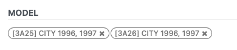

## field one2many
for very simple

```xml
<field name="lines">
    <tree string="Insurances" editable="buttom">
        <field name="partner_id" />
        <field name="product_ids" widget="many2many_tags" />
    </tree>
</field>
```

## data range
```xml
<label for="date_start" string="Date"/>
<div class="o_row">
    <field name="date_start" widget="daterange" nolabel="1" class="oe_inline" options="{'related_end_date': 'date_end'}"/>
    <i class="fa fa-long-arrow-right mx-2" aria-label="Arrow icon" title="Arrow"/>
    <field name="date_end" widget="daterange" nolabel="1" class="oe_inline" options="{'related_start_date': 'date_start'}"/>
</div>
```


## many2one with address

```xml
<field name="partner_id" widget="res_partner_many2one"
    context="{'res_partner_search_mode': 'customer', 'show_address': 1, 'show_vat': True}"
    options='{"always_reload": True}'/>
```


## many2many_tags
support form/tree
```xml
<field name="product_ids" widget="many2many_tags" />
```



## widget radio for selection

```xml
 <field name="type" widget="radio"/>
```

## attrs hide and show 
can use in field,group,page
```xml
<field name="ins_driver_mode" widget="redio" />
<field name="ins_driver_one_name" 
    attrs="{'invisible': [('ins_driver_mode','=','specific')]}"/>
```


## groups access

```xml
<field name="company_id" groups="base.group_multi_company" optional="show" readonly="1"/>
<field name="company_id" groups="!base.group_multi_company" invisible="1"/>
```